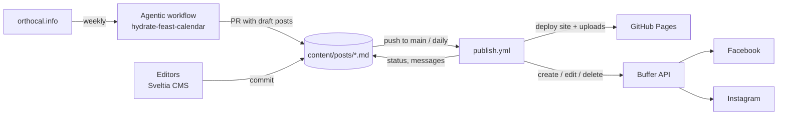

# Parish social media pipeline

A small, git-based pipeline for the social media team of an Orthodox parish:

- **Web editor** (Sveltia CMS on GitHub Pages) where non-technical editors write
  posts and add images, files and links such as YouTube videos.
- **Posts are Markdown files** in [`content/posts/`](content/posts), named
  `YYYY-MM-DD-slug.md`, e.g. `2026-10-11-fathers-of-the-seventh-ecumenical-council.md`.
- **Feast-day drafts**: a weekly [GitHub Agentic Workflow](https://github.github.com/gh-aw/)
  reads [orthocal.info](https://orthocal.info) and drafts posts for Sundays and
  great feasts about three months ahead. It opens a pull request with them.
- **Buffer scheduling**: approved posts are scheduled in [Buffer](https://buffer.com)
  for Facebook and Instagram. Edits to a scheduled post update it in Buffer,
  and canceling a post removes it.



## Post lifecycle

Each post's `status` field holds its publication state:

| Status | Set by | Meaning |
| --- | --- | --- |
| `draft` | editor / agent | Being written. Never sent to Buffer. |
| `in-review` | editor | Ready for someone else to check. |
| `approved` | editor | Ready. It will be scheduled in Buffer once it is within `schedule_window_days` of its publish time. |
| `scheduled` | automation | Queued in Buffer on every selected channel. Edits are pushed to Buffer. |
| `published` | automation | Buffer reports it was sent. |
| `canceled` | editor | Do not post. It is removed from Buffer if it was queued. |

Moving a scheduled post back to `draft`, `in-review` or `canceled`, or
deleting the file, removes it from Buffer. Changing the publish date renames
the file to keep the date prefix accurate. When the automation needs attention
from a person (missing image, time in the past, Buffer error), it writes a
plain-English explanation into the post's `sync_message` field.

### Front matter

```yaml
---
title: St Nicholas                      # for the team; not posted
status: approved
publish_at: 2026-12-06T07:00:00-06:00   # parish local time
channels: [facebook, instagram]
images:                                 # optional; Instagram needs at least one; up to 10
  - image: /uploads/st-nicholas.jpg
    alt: Icon of St Nicholas
link: https://youtu.be/...              # optional; added to the caption
attachments:                            # optional; download links added to the caption
  - file: /uploads/bulletin.pdf
    label: This week's bulletin
first_comment: "#SaintNicholas"         # optional
notes: For the team only                # optional; never posted
sync_message: ""                        # written by the automation
source: manual                          # or orthocal
orthocal_date: 2026-12-06               # set on calendar drafts
---
The caption goes here.
```

Buffer post IDs are kept in [`state/buffer.json`](state/buffer.json), not in
the posts, so the editor never overwrites them.

## Repository layout

| Path | Purpose |
| --- | --- |
| `content/posts/` | The posts |
| `config/pipeline.yml` | Parish name, time zone, calendar and Buffer settings |
| `site/` | GitHub Pages site: landing page, `admin/` (the editor) and `uploads/` (images and files) |
| `scripts/` | Node scripts: `hydrate-calendar`, `sync-buffer`, `validate-posts`, `buffer-channels` |
| `.github/workflows/hydrate-feast-calendar.md` | Agentic workflow (compile with `gh aw compile`) |
| `.github/workflows/publish.yml` | Deploys the site and syncs Buffer |
| `.github/workflows/validate.yml` | Tests and validates posts on PRs |
| `state/buffer.json` | Buffer IDs per post and channel (managed by automation) |

## Design notes

- **The Buffer sync is deterministic, not agentic.** The agent only drafts
  captions. Scheduling is ordinary code in `scripts/lib/sync.mjs`, so the
  Buffer API key is never given to an AI model, and the same post always
  produces the same Buffer request. Content hashes mean only real edits call
  Buffer.
- **Buffer rather than direct Meta APIs.** Buffer handles Facebook Page and
  Instagram Business publishing and token refresh. Its free plan allows about
  10 queued posts per channel, which is why posts are only sent to Buffer
  14 days ahead (`schedule_window_days`).
- **Media are served from GitHub Pages.** Buffer needs public URLs for images,
  so uploads are published with the site before syncing. Anything in
  `site/uploads/` is public, even when it is not posted yet. Draft *text* is not
  published.

## Development

Requires Node 22+.

```sh
npm ci
npm test                                        # unit tests
npm run validate                                # validate all posts
npm run hydrate -- --dry-run                    # preview calendar drafts
npm run sync -- --dry-run                       # preview Buffer changes
BUFFER_API_KEY=... npm run buffer:channels      # list Buffer channel IDs
gh aw compile                                   # after editing the agentic workflow
```

See [docs/setup.md](docs/setup.md) for first-time setup and
[docs/editor-guide.md](docs/editor-guide.md) for the team.
